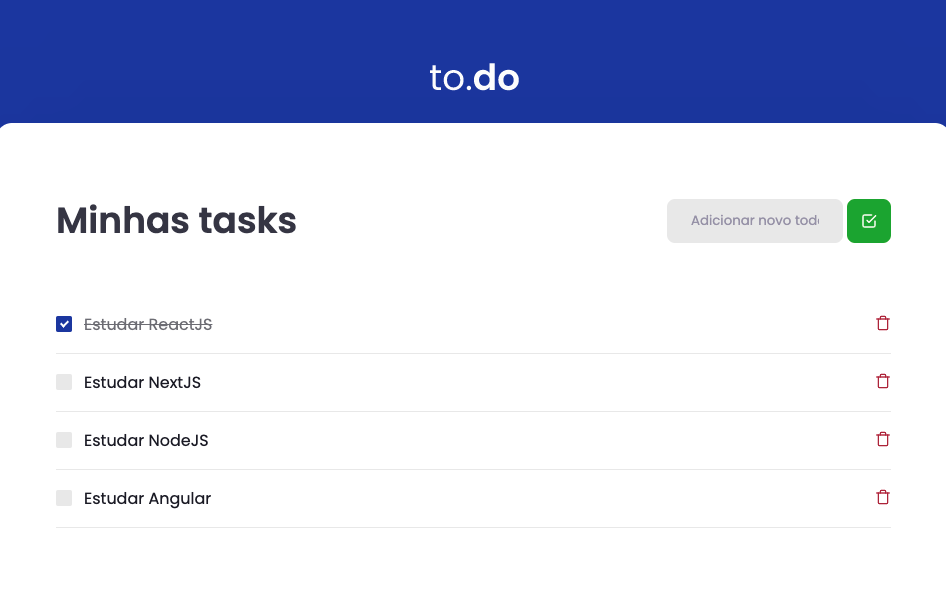

# :rocket: Desafio 01 do Ignite Bootcamp

Aplicação de To Do List do desafio 01 no Bootcamp Ignite da Rocketseat utilizando ReactJS.

---

## 💡 Preview

---

## 📌 Objetivo

Desafios propostos para prática e fortalecimentos dos seguintes conceitos:

- React;
- Babel;
- Webpack;
- Yarn;
- Jest;

---

Feito com 💜 por [Camilla Correia](https://www.linkedin.com/in/camilla-correia-3203a3139/)
